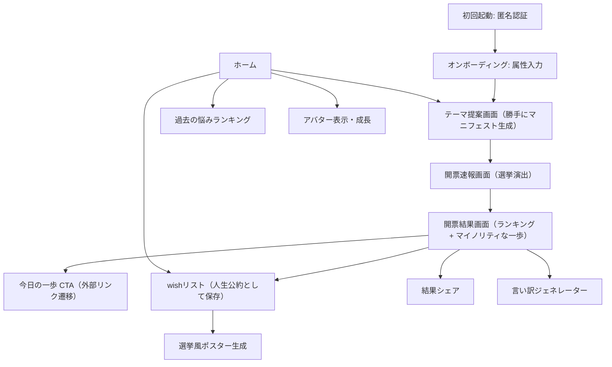

# 1000人生総選挙 実装計画

AIが勝手に「1000人生総選挙」を開催し、似た境遇の1000人がどんな「小さな一歩」を踏み出したかを選挙開票風UIで見せることで、ライフデザインの心理的ハードルを極限まで下げるアプリ。

- 参照: Notion「ハッカソンメモ」「機能一覧」「あるべき姿」
- 対象機能（7個）: マイノリティな一歩 / wishリスト / 勝手にマニフェスト生成＆パーソナライズ相談 / アバター作成 / 言い訳ジェネレーター / 選挙風ポスター生成 / 過去の悩みランキング

---

## 1. 技術スタック

| 領域 | 選定 | 理由 |
| --- | --- | --- |
| フレームワーク | React Native + Expo (SDK 最新, TypeScript) | 指定要件 |
| ルーティング | Expo Router（ファイルベース） | Expo標準。`.agents/skills/expo-router` のスキルあり |
| スタイリング | NativeWind (Tailwind CSS) | `.agents/skills/expo-tailwind-setup` のスキルあり。選挙風UIを高速に組める |
| DB / バックエンド | Firebase（Firestore + Anonymous Auth） | セットアップが簡単。匿名認証が「認証不要だがユーザー判別は必要、端末変更時は失われてOK」という要件にそのまま合致 |
| AI | Google Gemini API（`gemini-2.x-flash`） | 無料枠が大きくハッカソン向き。JSONモードで構造化出力 |
| 画像生成（ポスター） | `react-native-view-shot` + ローカル合成 | AI画像生成より確実・無料。選挙ポスターテンプレに顔写真＋公約テキストを重ねてキャプチャ |
| シェア | `expo-sharing` + `react-native-view-shot` | 結果画面・ポスターを画像としてシェア |
| アニメーション | `react-native-reanimated` | 開票速報の得票バーが伸びる演出など |

### ユーザー判別の仕組み

- 初回起動時に Firebase Anonymous Auth で自動サインイン → UID が発行される。
- UID は端末に永続化され、再起動しても同一ユーザーとして扱われる。
- 端末変更時は新しい UID になる（要件上許容）。
- Firestore セキュリティルールで `request.auth.uid` による本人データ保護＋集計用データの読み取り公開を行う。

### AI呼び出し方針

- ハッカソン速度優先で、クライアントから Gemini API を直接呼ぶ（キーは `EXPO_PUBLIC_GEMINI_API_KEY`）。
- キー露出リスクは認識した上で、本番化する場合は Firebase Cloud Functions 経由に移す（サービス層 `services/ai/` に隠蔽しておき、差し替え可能にする）。
- API障害・開発時用に、モックレスポンス（固定JSON）へのフォールバックを `services/ai/mock/` に用意する。

---

## 2. 画面フローと機能マッピング



### 各機能の実装方針

1. **勝手にマニフェスト生成＆パーソナライズ相談**
   - オンボーディングで基本属性（年代・交際状況・貯金レンジ・趣味・モチベーション等）を選択式で入力。
   - 属性を Gemini に渡し、「そろそろプロポーズしないとヤバい？」のような悩みテーマを3〜5個、おせっかい口調で提案（JSON出力）。
   - テーマを1つ選ぶと総選挙が開始される。

2. **総選挙（コア体験）＋ マイノリティな一歩**
   - 選択テーマ＋属性を Gemini に渡し、「あなたに近い1000人」の投票結果をシミュレーション生成。
     - 上位候補: 現実的な小さな一歩（例: 「求人を1件だけ見た 312票」）
     - マイノリティ枠: 低得票のハードル激低な一歩（例: 「給料明細を眺めてため息をついた 5%」「求人サイトを開いて3秒で閉じた 3%」）を必ず数件含めるようプロンプトで指定。
   - 開票速報画面: NHK開票速報風に得票バーがアニメーションで伸び、「当選確実」の演出。
   - 結果画面: ランキング一覧＋各候補に「今日の一歩」ボタン（外部URL遷移 or 具体アクション提示）。タップをKPIイベントとして Firestore に記録。

3. **wishリスト（人生公約）**
   - 結果画面の候補を「公約として掲げる」ボタンで自分のwishリストに保存。自由入力の公約追加も可。
   - Firestore の `users/{uid}/wishes` に保存。達成チェックでステータス更新（→アバター成長のトリガー）。

4. **アバター作成**
   - 属性入力から初期アバターを生成（パーツ組み合わせ式のローカルアセット。例: 表情・服・小物のSVG/PNGレイヤー合成）。
   - wish達成数・総選挙参加数に応じてレベルアップし、見た目（衣装・背景・タスキ等）が変化。
   - ホーム画面に常駐表示。

5. **言い訳ジェネレーター**
   - wishが一定期間未達成のとき、または結果画面の「やらなかったことにする」ボタンから起動。
   - Gemini に「自己肯定感を保つ、ユーモラスで優しい言い訳」を生成させて表示・シェア可能に。

6. **選挙風ポスター生成**
   - 端末の写真（`expo-image-picker`）＋選んだ公約テキストを、選挙ポスター風テンプレート（キャッチコピー・名前枠・タスキ風装飾）に合成。
   - `react-native-view-shot` でキャプチャして保存・シェア。

7. **過去の悩みランキング**
   - 全ユーザーが選んだテーマを Firestore の集計コレクションにインクリメント記録。
   - 「世の中のみんなが悩んでいることランキング」として表示（回遊のきっかけ＝KPIの複数テーマ回遊率に寄与）。

---

## 3. ディレクトリ構成

```
life_general_election/
├── app/                          # Expo Router（ルーティング専用、ロジックは持たない）
│   ├── _layout.tsx               # ルートレイアウト（認証初期化・プロバイダ）
│   ├── index.tsx                 # ホーム（アバター常駐・各機能への入口）
│   ├── onboarding/
│   │   ├── _layout.tsx
│   │   ├── index.tsx             # 属性入力（ステップ形式）
│   │   └── avatar.tsx            # 初期アバター作成
│   ├── election/
│   │   ├── themes.tsx            # AIによる悩みテーマ提案・選択
│   │   └── [electionId]/
│   │       ├── live.tsx          # 開票速報（アニメーション演出）
│   │       └── result.tsx        # 開票結果（ランキング・マイノリティな一歩・今日の一歩・シェア）
│   ├── wishes/
│   │   ├── index.tsx             # wishリスト（人生公約一覧・達成チェック）
│   │   └── poster.tsx            # 選挙風ポスター生成
│   ├── ranking.tsx               # 過去の悩みランキング
│   └── excuse.tsx                # 言い訳ジェネレーター（モーダル表示）
│
├── src/
│   ├── components/               # 汎用UIコンポーネント
│   │   ├── ui/                   # Button, Card, ProgressBar など
│   │   └── election/             # VoteBar, CandidateCard, ElectedStamp（当確ハンコ）など選挙演出系
│   ├── features/                 # 機能単位のロジック＋専用コンポーネント
│   │   ├── onboarding/
│   │   ├── election/             # 開票シミュレーション・結果表示
│   │   ├── wishes/
│   │   ├── avatar/               # パーツ合成・成長ロジック
│   │   ├── poster/               # テンプレ合成・view-shot
│   │   ├── excuse/
│   │   └── ranking/
│   ├── services/
│   │   ├── firebase/             # 初期化・匿名認証・Firestoreアクセス（repository層）
│   │   │   ├── config.ts
│   │   │   ├── auth.ts
│   │   │   ├── userRepository.ts
│   │   │   ├── wishRepository.ts
│   │   │   ├── electionRepository.ts
│   │   │   └── rankingRepository.ts
│   │   └── ai/
│   │       ├── gemini.ts         # Gemini APIクライアント（JSONモード）
│   │       ├── prompts/          # テーマ提案・総選挙生成・言い訳のプロンプト定義
│   │       └── mock/             # 開発用モックレスポンス
│   ├── hooks/                    # useAuth, useElection, useWishes など
│   ├── stores/                   # グローバル状態（Zustand想定: ユーザープロファイル・アバター状態）
│   ├── types/                    # UserProfile, Election, Candidate, Wish などの型定義
│   ├── constants/                # テーマ色・選択肢マスタ（属性の選択肢等）
│   └── utils/
│
├── assets/
│   ├── avatar/                   # アバターパーツ画像（レイヤー別）
│   └── poster/                   # ポスターテンプレート素材
├── docs/
│   └── implementation-plan.md    # 本ドキュメント
├── firestore.rules
├── .env.example                  # EXPO_PUBLIC_GEMINI_API_KEY 等
├── app.json / tsconfig.json / tailwind.config.js など
└── package.json
```

---

## 4. Firestore データモデル

```
users/{uid}
  profile: { ageRange, relationshipStatus, savingsRange, hobbies[], motivation }
  avatar: { level, parts: { face, outfit, accessory }, exp }
  createdAt

users/{uid}/elections/{electionId}
  themeId, themeLabel
  candidates: [ { id, label, votes, isMinority, actionUrl? } ]   # AI生成結果を保存（再表示用）
  createdAt

users/{uid}/wishes/{wishId}
  text, sourceElectionId?, status: "active" | "done" | "excused"
  createdAt, doneAt?

themeStats/{themeId}              # 過去の悩みランキング用（全体公開・集計）
  label, count                    # 選択時に increment

events/{eventId}                  # KPI計測（今日の一歩タップ・シェア等）
  uid, type: "step_tap" | "share" | "theme_view", themeId, createdAt
```

セキュリティルール方針:
- `users/{uid}/**`: `request.auth.uid == uid` のみ読み書き可。
- `themeStats`: 全認証ユーザー読み取り可。書き込みは `count` のincrementのみ許可。
- `events`: 認証ユーザーの作成のみ可（読み取り不可）。

---

## 5. 実装フェーズ

### Phase 0: プロジェクトセットアップ
- `create-expo-app`（TypeScript）＋ Expo Router 構成。
- NativeWind セットアップ（`.agents/skills/expo-tailwind-setup` のスキルに従う）。
- Firebase プロジェクト作成、Anonymous Auth 有効化、Firestore 作成、`services/firebase/` 実装。
- 起動時の匿名サインイン → `useAuth` フック。
- Gemini クライアント＋モックフォールバックの骨組み。

### Phase 1: コア体験（MVP）
- オンボーディング（属性入力・選択式ステップUI）。
- 勝手にマニフェスト生成（AIテーマ提案）画面。
- 総選挙生成プロンプト＋開票速報アニメーション画面。
- 開票結果画面（ランキング＋マイノリティな一歩＋今日の一歩CTA＋KPIイベント記録）。
- 結果画面のシェア（view-shot画像化 → expo-sharing）。

### Phase 2: 定着機能
- wishリスト（公約の保存・一覧・達成チェック）。
- 過去の悩みランキング（themeStats集計＋表示）。
- ホーム画面（回遊導線の整理）。

### Phase 3: 遊び・拡張機能
- アバター作成＆成長（パーツ合成・レベルアップ演出）。
- 言い訳ジェネレーター。
- 選挙風ポスター生成（image-picker＋テンプレ合成＋view-shot）。

---

## 6. 未確定事項（前提としたデフォルト）

- **AIプロバイダ**: Gemini API を前提。OpenAI等に変える場合は `services/ai/` の差し替えのみで対応可能な構成にする。
- **APIキーの置き場所**: ハッカソン速度優先でクライアント直呼び（`EXPO_PUBLIC_` env）。本番化時は Cloud Functions へ移行。
- **ポスター生成**: AI画像生成ではなくローカルテンプレ合成を採用（確実性・コスト優先）。AI生成に変えたい場合は要相談。
- **状態管理**: Zustand を想定（軽量・Expoと相性良）。
